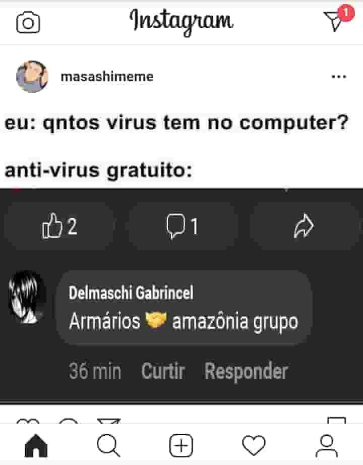

# ArmáriosPágina

## Entendendo

Nós, do grupo Amazônia Grupo, estamos em guerra com a página Armários Página após a confusão apresentada na imagem anterior.

Esse repositório apresenta uma ferramenta a ser utilizada como arma, mas é uma ótima ferramenta que pode ser usada para fazer imagens em geral hehe.

Sim, estamos utilizando o nome de nosso inimigo como arma.

## Inspiração

Baseia-se em templates e sources, como o [Feijoada Simulator](http://feijoadasimulator.top/).

Na verdade é a mesma idéia. Não queremos copiar, mas quem liga né.

----

Licensiado sob GPL-3

